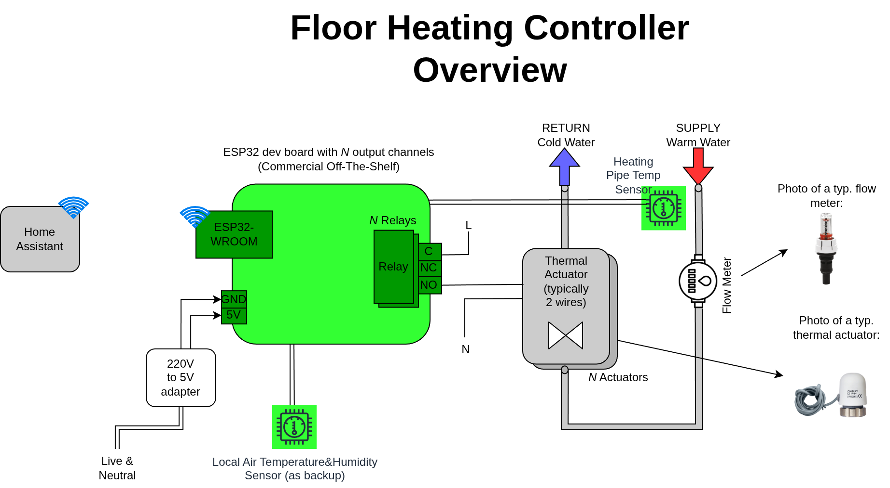
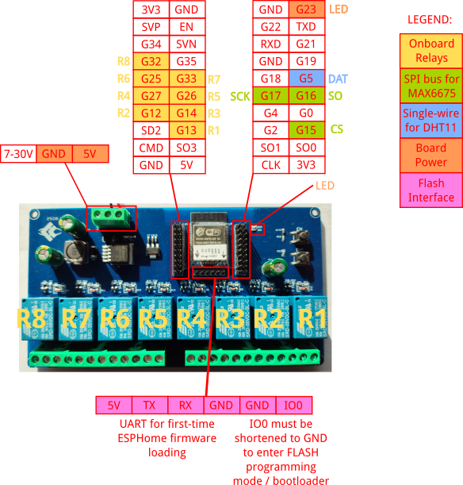

# esphome-floor-heating-controller

This is an [ESPHome](https://esphome.io/) project to integrate in [HomeAssistant](https://www.home-assistant.io/) a floor heating controller, i.e. a board that can turn on or off the flow of warm water in under-floor heating pipes.

In particular this project provides an [ESPHome package](https://esphome.io/components/packages/) that is easy to reference
from an ESPHome configuration. Keep reading for more details.


## Highlights

* Plain simple actuator board, all the hardware is **Commercial Off-The-Shelf** (COTS), 
typically available on Aliexpress or similar online stores, and very cheap; easy to replace in future if it fails;
* Connects to your [Home Assistant](https://www.home-assistant.io/) instance via Wi-fi;
* Exposing to HomeAssistant up to 8 basic switches plus 2 temperature sensors; each switch represents an heating under-floor circuit; temperature sensors provides measurements for both the incoming warm water and for the room temperature.
* [work in progress]: Designed to be **capable of running in a dumb, non-smart mode** if Wi-fi connection drops
or your HomeAssistant instance has troubles;


## Floor Heating Overview

This project is all about controlling the **thermal actuators** that are typically installed
on the floor heating **manifold**:


If you have floor heating in your house, then it's very likely you have such kind of manifold somewhere
behind a panel or cover.
The number of **thermal actuators** will vary and will depend on the size of the floor / rooms that are
heated by the system. 

Let's focus on the actuators. There are 2 standard types:
1. 24V AC/DC actuators: these are most common in North America
2. 230V AC actuators: these are most common in Europe

The thermal actuators I have installed in my manifolds (and automated by this project) are pretty standard 230V ones. 
Here's a brief summary of their properties:

* Electrical:
    * powered at 230V in this project (but since the relay board exposes dry contacts, it could be used to power also 24V thermal actuators).
    * normally-closed (NC)
    * 3W power consumption

* Mechanical:
    * installation size: M30 x 1.5 mm
    * 4.5mm stroke
    * response time: 180-300s

Finally note that this project does not provide any attempt to make the flow-meters smart devices. That would be a nice plus but probably not very useful in practice (?)


## Architecture Overview

In the following picture the parts in green are those provided by this project.
The grey parts (an HomeAssistant instance, thermal actuators, flow meters, piping, etc) is outside the scope
of this project and is considered to be already installed and working fine:



This project allows to easily setup in HomeAssistant a [Generic Thermostat](https://www.home-assistant.io/integrations/generic_thermostat/) entity that allows to control the floor heating system:


```yaml
climate:
  - platform: generic_thermostat
    name: Floor Heating
    heater: switch.floorheatingactuatorcontroller_relay1
    target_sensor: sensor.floorheatingactuatorcontroller_ambient_temperature
    min_temp: 15
    max_temp: 25
    ac_mode: false
    target_temp: 17
    cold_tolerance: 0.3
    hot_tolerance: 0
    min_cycle_duration:
      minutes: 1
    initial_hvac_mode: "off"
    precision: 0.1
    # preset mode temps
    away_temp: 20
    home_temp: 22
    sleep_temp: 21
```

One climate entity is connected to 1 temperature sensor and to 1 switch for the "heater" exposed by this ESPHome project.
So if you have e.g. 5 rooms on your floor and you want to control heating independently you should:

* install a temperature sensor in each room
* cable the thermal actuator of each room to each relay available on this ESPHome project (see below ESP32 board details)
* define a Generic Thermostat for each room

Please note that instead of writing YAML code in your HomeAssistant `configuration.yaml` file you probably
want to use the HomeAssistant UI: look for Helpers and choose `Generic Thermostat` from the list.


## Bill Of Material

* ESP32 relay board [bought on Aliexpress](https://it.aliexpress.com/item/1005007027676026.html?spm=a2g0o.order_list.order_list_main.31.42f53696cth4st&gatewayAdapt=glo2ita) (17.5€ in Oct 2025).
Its main characteristics are:

  * Sports an [ESP32-WROOM-32E module](./datasheets/esp32-wroom-32e_esp32-wroom-32ue_datasheet_en.pdf) with 240MHz clock, 320kB RAM, 4MB Flash
  * 5V DC power supply terminals
  * 8 relay channels, both NC and NO contacts available


* 230V to 5V power adapter (10W), [bought on Aliexpress](https://it.aliexpress.com/item/1005011566356715.html?spm=a2g0o.order_list.order_list_main.41.53a81802JCkFmo&gatewayAdapt=glo2ita) (4€ in Oct 2025); please note that it's very important that you choose a power adapter module that can provide up to 2Amps because when the relay modules switch simultaneously, they can draw quite a good amount of power. [I had many issues](https://community.home-assistant.io/t/power-cycle-needed-after-triggering-a-relay-off-on-what-about-the-software-watchdog/986634/3) with the ESP32 board hanging or rebooting during OFF->ON transitions due to power supplies that were rated just 5V and 1A (5W).
Finally see also the section down below "Power Consumption".

* Temperature sensors, bought on Aliexpress (few € in Oct 2025)

  * `MAX6675` and a K-type thermocouple for reading pipe temperature,
    see https://esphome.io/components/sensor/max6675/
  * `DHT11`: Digital Temperature Humidity Sensor,
    see https://esphome.io/components/sensor/dht/

Alternative sensors I also tested in an instance of this ESPHome Package are:

  * `MAX31855` and a K-type thermocouple for reading pipe temperature,
    see https://esphome.io/components/sensor/max31855/
  * `DHT22`: Digital Temperature Humidity Sensor,
    see https://esphome.io/components/sensor/dht/


Electrical consideration: the amount of Amperes flowing on the relay board presented below will be minimal: at 230V to supply the rated 3W power of each actuator the wires need to carry only about 14mA.

## ESP32 Relay Board Pinout

The ESP32 relay board listed in the BOM above mounts 8 relays and an handy LED.
The pinout is:

* GPIO23: led D20
* GPIO13: relay 1, indicated as `R1` below
* GPIO12: relay 2, indicated as `R2` below
* GPIO14: relay 3, indicated as `R3` below
* GPIO27: relay 4, indicated as `R4` below
* GPIO26: relay 5, indicated as `R5` below
* GPIO25: relay 6, indicated as `R6` below
* GPIO33: relay 7, indicated as `R7` below
* GPIO32: relay 8, indicated as `R8` below

Please note that GPIO12 is a strapping PIN and should only be used for I/O with care.
Attaching external pullup/down resistors to strapping pins can cause unexpected failures.
See https://esphome.io/guides/faq.html#why-am-i-getting-a-warning-about-strapping-pins

In addition to these, the following GPIOs are used for the temperature sensors:

* GPIO5: `DHT11` sensor
* GPIO16 (MISO), GPIO17 (CLK) and GPIO15 (CS): for the SPI bus to read the `MAX6675` sensor

Graph of the ESP-to-sensor connections:


And a picture to help with physical connection setup:




## Full ESPHome configuration

See the [main.yaml](./main.yaml) file for the ESPHome package provided by this project.
Please note that this is an [ESPHome package](https://esphome.io/components/packages/) and thus it uses [substitutions](https://esphome.io/components/substitutions/) to make the YAML config file as reusable as possible.

An actual ESPHome YAML config using this package could be:

```yaml
packages:
  remote_package_files:
    url: https://github.com/f18m/floor-heating-controller/
    files: 
      - path: main.yaml
        vars:
          encryption_key: !secret encryption_key
          wifi_ssid: !secret wifi_ssid
          wifi_password: !secret wifi_password
          wifi_ap_password: !secret wifi_ap_password
          ota_password: !secret ota_password
          relay1_name: "Living Room Relay"
          relay2_name: "Bedroom Relay"
          relay3_name: "Kitchen Relay"
          relay4_name: "Bathroom Relay"
          relay5_name: "Dining Room Relay"
          relay6_name: "Office Relay"
          relay7_name: "Guest Room Relay"
          relay8_name: "Hallway Relay"
    ref: main  # optional
    refresh: 1d  # optional

esphome:
  name: "floorheating-p0"
  friendly_name: FloorHeatingActuatorController-P0
```

which is basically assigning the secrets defined in the ESPHome global "secrets.yaml" to the variables of this package.
Then it's overriding just the name & friendly name from the package.
See e.g. [example-instance.yaml](./example-instance.yaml)
and [example-instance-with-different-sensors.yaml](./example-instance-with-different-sensors.yaml).


Also note that the [ESPHome package](./main.yaml) from this repo will use the board LED to act
as the ESPHome [status LED](https://esphome.io/components/status_led/). So as summary:

* It will **blink slowly (about every second) when a warning is active**. Warnings are active when for example reading a sensor value fails temporarily, the WiFi/MQTT connections are disrupted, or if the native API component is included but no client is connected.

* It will **blink quickly (multiple times per second) when an error is active**. Errors indicate that ESPHome has found an error while setting up. In most cases, ESPHome will still try to recover from the error and continue with all other operations.

* It will **stay off otherwise**.


## First ESPHome install

When you receive your ESP32 relay board, you will need to carry out the first ESPHome installation
by "wire". Afterwards, you'll be able to install any ESPHome profile over the wireless connection using
the so-called On-The-Air update (OTA update).

Make sure you read carefully the [ESPHome guide](https://esphome.io/guides/physical_device_connection/)
on how to Physically Connecting to your Device.

You will need a USB-to-serial module.
I bought [one on Aliexpress](https://it.aliexpress.com/item/1005004742270942.html?spm=a2g0o.order_list.order_list_main.107.33a03696c66vOs&gatewayAdapt=glo2ita) for 2€.
A couple of pictures zooming on the programmer itself and then its connections to the ESP32 relay board:


Once physical connection is ready, you will be able to install ESPHome initial firmware:

1. Log on your HomeAssistant and go to the ESPHome web interface
2. Create a new device, copy-pasting the [example-instance.yaml](./example-instance.yaml)
3. Launch "Validate" from the 3-dots menu for your new ESPHome device
4. Launch "Install" from the 3-dots menu for your new ESPHome device and choose "Plug into this computer" option:


After successful flashing you should be able to see logs coming from your board and, if the Wifi credentials
are OK, your board should appear in the list of DHCP clients of your DHCP server.


## Labelling of the board

Since most likely your floor heating controller will be installed in some hidden box
and will stay around for a lot of time (many years hopefully), I suggest to provide 
some documentation reference for that.
A simple approach is to print a QR code pointing at this page.

Here you can find a QR code I produced with the optimal [miniQR code generator](https://mini-qr-code-generator.vercel.app/):


## Final assembly

TO WRITE / PUT SOME PICTURE HERE


## Power consumption

Some consideration about power consumption, assuming worst case scenario:

* all 8 relays turned ON, plus all their LEDs light on
* ESP32 being full powered ON, peaking at 240mA of power usage
* each relay drawing about 100mA to power on
* each LED drawing 20mA 
* temperature sensors have a <2mA power usage and thus are negligible

A back-of-the-envelope computation gives a total of **~1.2Amps** of power drawn from the 5V rail, which means about **7W**.

The power consumption on the 230V rail is, again in the worst case, **~35W** assuming 8 thermal actuators all open and all consuming about 3W (pretty standard), plus the 7W power usage for the controller board.


## TODO

* Write the [external component](https://esphome.io/components/external_components/) that will make it possible to control relays using the local temp sensor when connection to HA fails.


## Similar projects

* [Smart Underfloor Heating Controller](https://hackaday.io/project/190828-smart-underfloor-heating-controller)
* [Nicolas Liaudat's Floor Heating Controller](https://github.com/nliaudat/floor-heating-controller)
